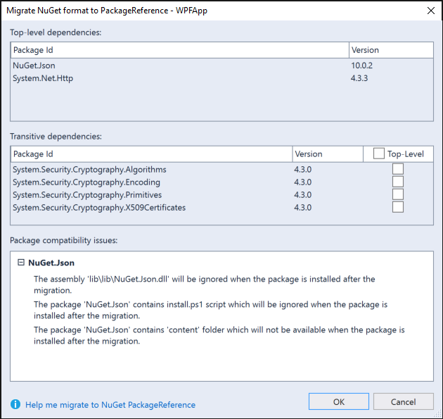
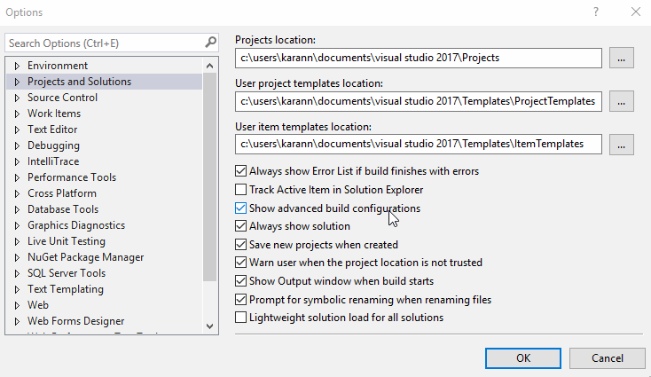

Last year, we introduced the option to [make PackageReference the default format](https://blog.nuget.org/20170316/NuGet-now-fully-integrated-into-MSBuild.html#what-about-other-project-types-that-are-not-net-core) for managing NuGet dependencies when installing the first NuGet package for a newly created project. With Visual Studio Version 15.7 Preview 3, we have introduced the capability to migrate existing projects based on `packages.config` to `PackageReference`. We continue to invest in making `PackageReference` better. Benefits of `PackageReference` include:
* Ability to manage all project dependencies from one place i.e. the project file
* An uncluttered view of top-level dependencies i.e. only those NuGet packages you directly installed in the project
* Faster package install/update times
* Better cache management with a global-packages folder instead of a solution-local packages folder
* Fine control over dependencies and content flow such as conditionally referencing a NuGet package per target framework, configuration, platform, or other pivots, and much more...

## Migrate your projects to PackageReference today!

To try out the new migration experience, [download Visual Studio 2017 Preview](https://www.visualstudio.com/vs/preview/), open a `packages.config` based project, and select **Migrate packages.config to PackageReference....** from the **References** right-click context menu in the **Solution Explorer**.

[*Not all project types will have this option.](#limitations)

The migrator analyzes the existing references, calculates the dependency graph, and categorizes them into top-level and transitive dependencies. You have the flexibility to mark a package, that was categorized as a transitive dependency, to be treated as a top-level dependency. It also scans for potential [package incompatibilities](https://docs.microsoft.com/en-us/nuget/reference/migrate-packages-config-to-package-reference#package-compatibility-issues) and warns about them.

### Backup and roll back
We create a backup of the project file and `packages.config` to `<solution_root>\MigrationBackup\<unique_guid>\<project_name>\` before the migration begins to allow you to [roll back to `packages.config`](https://docs.microsoft.com/en-us/nuget/reference/migrate-packages-config-to-package-reference#how-to-roll-back-to-packagesconfig) if necessary.

### Set PackageReference as the default
Open the Options dialog by selecting `Tools > Options`, and then select  `NuGet Package Manager > General`. From here you can change the "Default package management format" to PackageReference. This means when you install the first NuGet package for a newly created project, NuGet will use the PackageReference format. Newly created projects that come with existing NuGet references using packages.config (such as WPF), must be migrated to PackageReference after project creation.

### Limitations
Some project types do not yet support the `PackageReference` format. Also, some packages are [not fully compatible with `PackageReference`](https://docs.microsoft.com/en-us/nuget/reference/migrate-packages-config-to-package-reference#package-compatibility-issues). While we work towards bringing the `PackageReference` goodness to all project types, and to make these packages compatible with `PackageReference`, we have limited the option to migrate for C++, JS, and ASP.NET (.NET Framework) projects.

### Enhancements in the pipeline
We are actively working to [enhance PackageReference](https://github.com/NuGet/Home/issues/6763) with features such as locking the transitive dependencies, ability to consolidate package versions across projects in a solution, and more.

## We want to hear your feedback!
We want NuGet to meet the evolving needs of our community. For feedback specific to the migration experience, use this issue - [NuGet/Home#5877](https://github.com/NuGet/Home/issues/5877). For anything else, hit us up at [feedback@NuGet.org](mailto:feedback@nuget.org), and as always, if you run into any issues or have an idea, [open an issue on GitHub](https://github.com/Nuget/Home/issues).
